**SmartMedicine-智能医疗App**
=============================

# 项目介绍

#### 智能医疗App:

##### 项目功能

文章推荐,医疗社区,动态发布,在线问诊,AI问答,疾病预测,便捷搜索等功能

##### 模块及其技术栈

* 推荐算法：协同过滤，基于内容，神经网络
* 搜索引擎：ElasticSearch、word2vec/IK分词搜索、知识图谱
* IM系统：SpringCloud系列，Netty
* 网关：spring-cloud-gateway + Nginx
* 终端：Android、JNI/NDK
* 大数据：Hadoop、Spark、Flink、Hive、HBase
* 爬虫：selenium、lxml
* 后台：JS，Vue，ElementUI

[Spring项目](spring-server/README.md)
[Android项目](android-frontend/README.md)

## 设计思路

(下面内容包含UML图,要查看UML需要下载IDEA的插件:PlantUML):[PlantUML插件](https://plugins.jetbrains.com/plugin/7017-plantuml-integration)

[项目设计思路](项目设计思路.md)

## ⚠注意

此项目为个人2024年天津科技大学本科毕业设计论文，仅供开源学习参考。禁止用于其他用途。

[项目论文-本人本科毕业设计论文](20201220-陈治宇-基于机器学习的智能医疗对话APP的设计.pdf)

## 内容介绍

##### 文章推荐

基于nlp的内容推荐(Bert模型推荐分类 + 知识图谱) + 基于协同过滤\矩阵推荐(User CF,Item CF,MF,ALS,SVD) + 神经网络推荐(NCF)


推荐系统结果

根据用户行为，搜索内容，留存时间等进行推荐


推荐模块文章


矩阵分解

矩阵分解是为了从用户-item 矩阵中提取潜在因素，以便更好地预测用户对未见过物品的偏好，解决系数矩阵问题

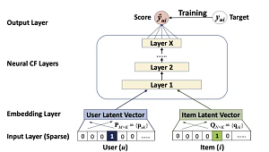

NCF算法框架

传统的矩阵分解方法（如 SVD）通常假设用户和物品之间的关系是线性的，而 NCF 通过使用深度学习模型，可以捕捉到更复杂的非线性关系，从而提高推荐的准确性。

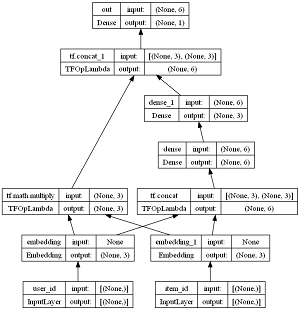

NeuMF张量图

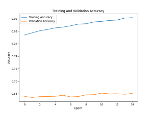

NeuMF_acc


NeuMF_loss


知识图谱

推荐系统中：知识图谱通过结构化的形式组织了大量的实体及其之间的关系，使推荐系统能够更好地理解用户的兴趣和偏好。

自然语言理解中：用于自然语言理解之后生成cql语句查询数据然后槽填充回答问题。

关系查询

```sql
SELECT r.relationship, e2.name
FROM entities AS e1
JOIN relationships AS r ON e1.id = r.entity1_id
JOIN entities AS e2 ON r.entity2_id = e2.id
WHERE e1.name = 'Entity A';
```

Mysql关系查询

```sql
MATCH (e:Entity {name: 'Entity A'})-[r]->(related)
RETURN r, related;
```

知识图谱查询关系

##### 搜索引擎

搜索引擎采用：ElasticSearch + word2vec/IK分词搜索 + 知识图谱

###### 词语相似关系模糊搜索

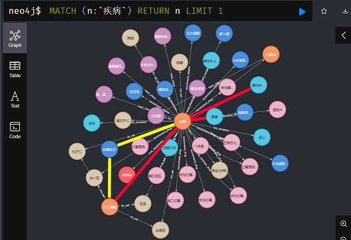
知识图谱-图路径
用于实体相似度功能,实现搜索引擎中的模糊搜索。
例如:搜索`"感冒"`会推荐`"鼻塞"`；其本质就是推荐。

###### 词语分词模糊搜索

ElasticSearch:倒排索引,用IK活着word2vec分词，实现搜索引擎中的分词模糊搜索。
例如搜索`"感冒症状"`若无,则会分词为`"感冒"` + "症状"搜索,如果存在`"感冒发烧的症状"`类似`"感冒" + "*" + "症状"`则会返回

##### AI问诊

基于nlp的自然语言理解(Bert意图分类) + 基于知识图谱的问答(知识图谱实体索引 + 槽填充)

查询意图分为:


对话_病因


对话_问诊

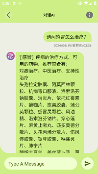

对话_治疗


Attention注意力机制

**Attention机制**是一种模仿人类注意力的机制，用于在处理信息时选择性地聚焦于特定部分。其主要思想是：在输入序列中，不同的词对输出的影响是不同的。Attention 机制通过计算输入序列中每个词的权重，决定哪些词在生成输出时更重要。

Bert是基于Transformer的，Transformer又是基于Attention机制的。


Bert词嵌入

BERT 接受输入时，会将每个词转换为向量，并加入位置编码和分段编码，以保留词序信息和句子信息。

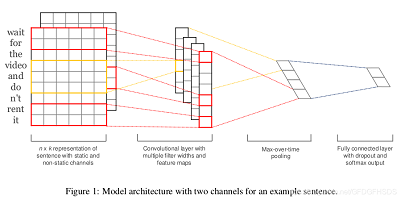

Text-CNN

Text-CNN通过卷积层捕捉短语和词组的局部特征，能够有效识别文本中的重要模式和结构，相比于传统的 RNN 或 LSTM，CNN 在处理长文本时具有更高的计算效率。

Text-CNN 在自然语言分类中的作用：特征提取，提高分类性能。

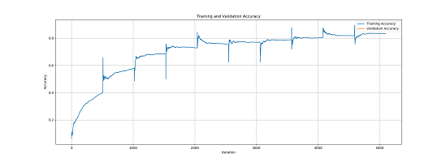

Bert模型意图分类准确度acc

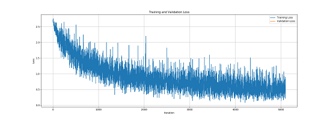

Bert loss函数损失值梯度下降

##### 医疗预测

数据源：Kaggle开源数据平台:[心脏病预测 --- Heart Disease Predictions](https://www.kaggle.com/code/desalegngeb/heart-disease-predictions)

使用多层感知机 + 全连接层实现预测：

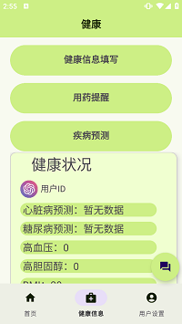

用户健康信息查看

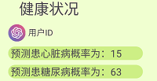

健康预测

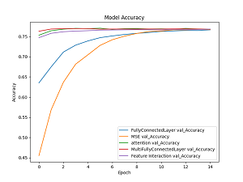

各种方法进行对比的acc准确度与训练轮次的关系

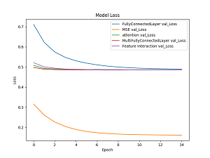

各种方法的loss与训练轮次的对比（其中MSE是均方误差，由于计算公式的原因，其loss远低于其他函数，但是并不代表其模型效果最好）
